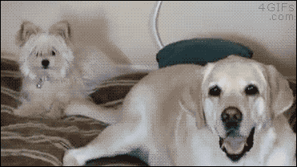

# slowtail

> A little tool to slow the tail :)

Have you ever experienced difficulties catching the tail?



**Struggle no more!**

## Installation

```sh
$ go get github.com/smileart/slowtail
```

## Usage

```sh
$ tail -f /var/log/fast.log | slowtail -d 2000 -
$ slowtail -d 2000 -r 1000 - < /var/log/long.log
$ slowtail -d 2000 /var/log/nginx/access.log
$ slowtail -d 2000 - < <(ls)
```

**You can even have a slow cat! SLOW CAT, Carl!**

```sh
$ cat /var/log/fast.log | slowtail -d 1000 -r 100 -
```


## License

MIT © [Serge Bedzhyk](http://github.com/smileart)
